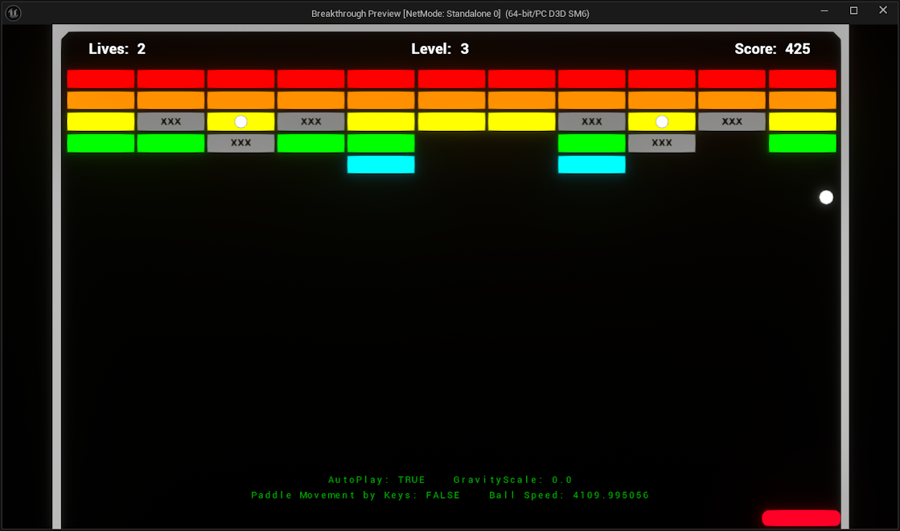
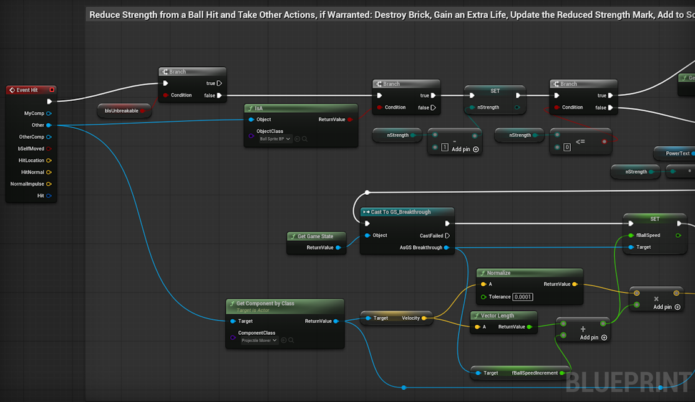

# Breakthrough

Breakthrough is a relatively simple 2.5D arcade game that I'm developing with the Unreal Engine (UE).  It involves a bouncing ball, a deflecting paddle, and destroyable blocks.  I'm forcing myself to create all game logic in the UE Blueprint scripting system.  I hope to make Breakthrough a fun game, but I'm developing this primarily as a learning exercise and to gain experience with Unreal and Blueprints.

## Developers
Justin Cooke

## Development Environment
I'm targeting this game to modern Windows machines and am using these IDEs and tools:
* **Unreal Engine/Editor 5.7** - IDE (https://www.unrealengine.com/)
* **paint.net 5.1.11** - Windows tool for image creation/editing (https://www.getpaint.net/)
* **Notepad++** - Powerful text editor (https://notepad-plus-plus.org/)
* **GitHub** - git repo and issue tracker (https://github.com/)

## Gameplay and Features

Breakthrough is a very simple game to play and will probably remind some of you older readers of an arcade game from the late 70s.  The player just presses the Spacebar to launch the ball and can pause/unpause the game with the ESC key.  Use mouse movement or the arrow keys to slide the paddle back and forth across the bottom of the play area.  Just keep the ball from falling below/past the paddle!

I've added some features to aid development and game balance/testing/tweaking efforts.  Primarily, this is the **Dev Overlay**.  Access this with the **CTRL+d** key combination.  This allows you to see the various toggles and motion-influencing parameters.  These include the UE ProjectileMovement gravity scale and the current ball speed.  All dev controls are adjustable with the key combinations specified below, even if the Developer Overlay is hidden.

### AutoPlay
One especially helpful feature is **AutoPlay** (enabled with **CTRL+a**).  With this turned on, the paddle will automatically follow the ball.  This is great for testing the standard gameplay, but also useful if you want to see how changing the motion parameters (like adding gravity) affects the game.  When you're tired of playing well, but need to keep testing, turn on AutoPlay!

### Key Combinations
This is a list of all parameters that can be toggled/adjusted in game, along with their key combinations.

| Key Combo            | Action                                                                  |
|----------------------|-------------------------------------------------------------------------|
| **CTRL + d**         | Toggle the Developer Overlay On/Off                                     |
| **CTRL + a**         | Toggle AutoPlay On/Off                                                  |
| **CTRL + g**         | Increase the Gravity                                                    |
| **CTRL + SHIFT + g** | Decrease the Gravity                                                    |
| **CTRL + l**         | Cycles through all available levels (can use to force load a new level) |

## Interesting Development Notes
* **Unreal Blueprint Scripting** To ensure I gained somewhat broad experience in Unreal's Blueprint (BP) script, I used BP for all logic in Breakthrough.  Even though I started this project in UE with C++ support, I never wrote any code in C++.  BP certainly has its quirks and there are numerous contexts in which it's really cumbersome to develop all game logic in this visual scripting system.  I'm glad I stuck with it, though, since I can now 'write' code in BPs across many game subsystems and patterns.  
  
  One aspect of BP scripting I really don't like is that it's binary, so any change diffs or code reviews (by examining text files) are basically impossible.  If you write BP scripts, you pretty much need to load them in the UE to view the logic.  To me, that's a serious drawback and will prmopt me to put as much logic as possible into C++ classes/code for future Unreal projects.
